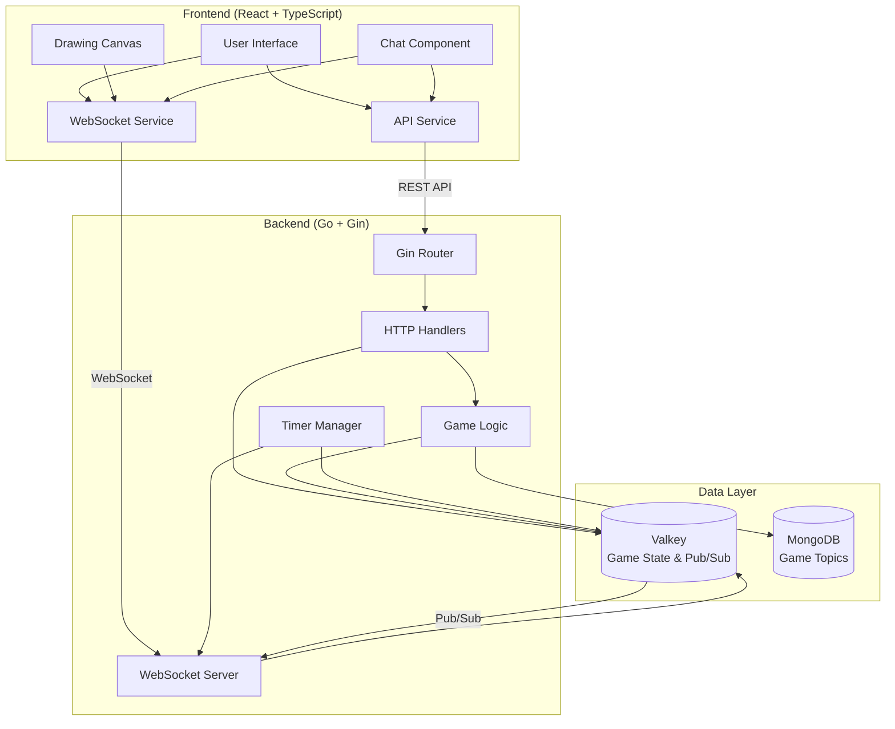
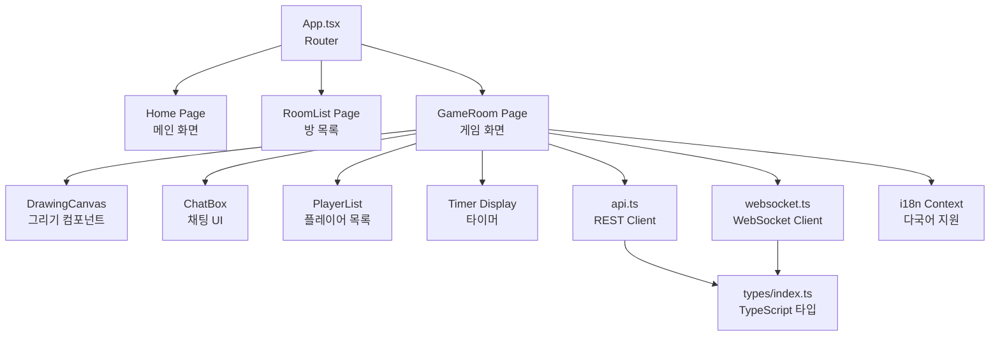
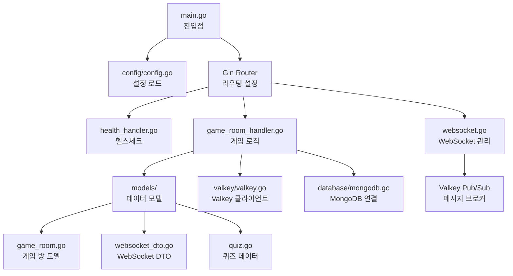
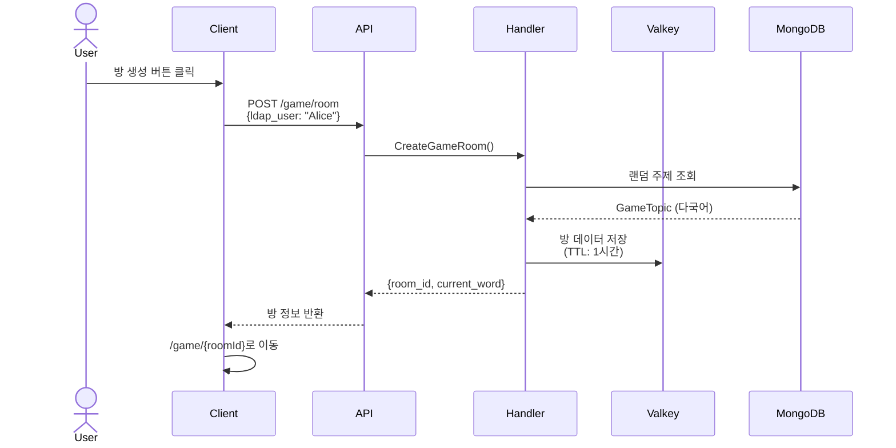
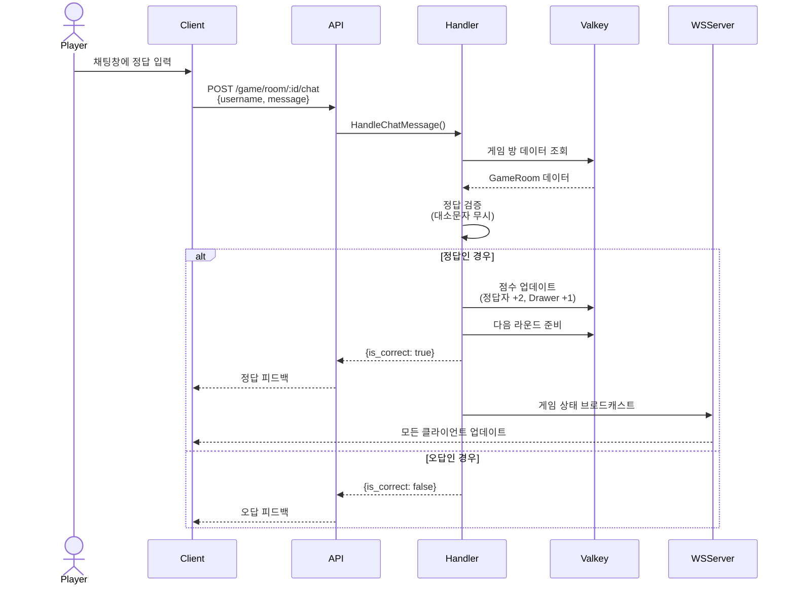
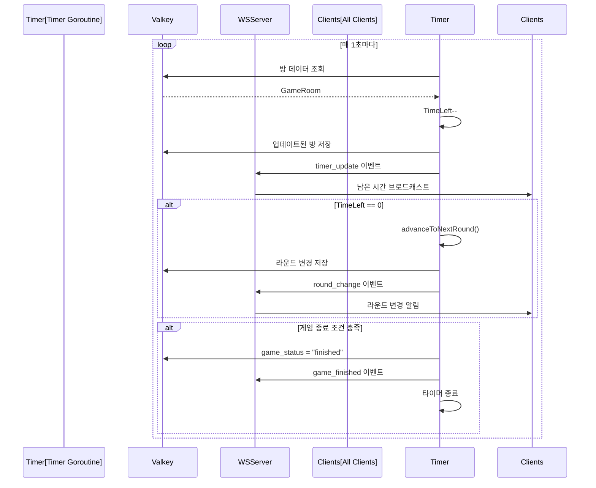
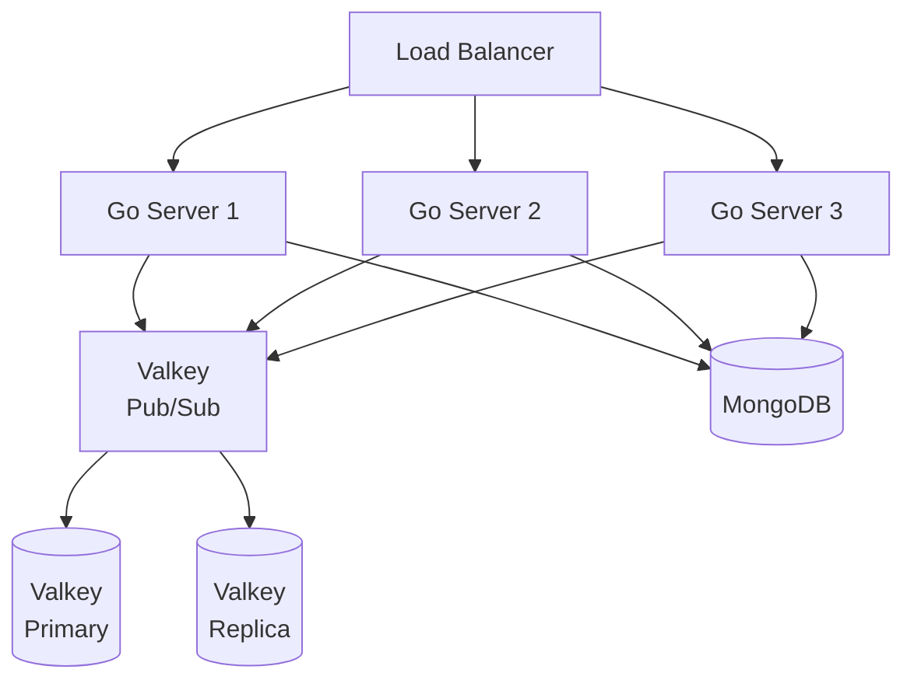

# 🏛️ Architecture Overview

이 문서는 Draw and Guess 프로젝트의 전체 아키텍처를 설명합니다. Mermaid 다이어그램을 통해 시스템 구조를 시각화하고, 각 컴포넌트의 역할과 데이터 흐름을 상세히 설명합니다.

## 📌 Mermaid 미리보기 설정

### VS Code에서 보기
1. VS Code 명령팔레트(`Ctrl+Shift+P`)에서 `>Extensions: Show Installed Extensions` 실행
2. `Markdown Preview Mermaid Support (bierner.markdown-mermaid)` 확장이 설치되어 있는지 확인
3. `>Markdown: Open Preview to the Side` 실행 또는 `Ctrl+K V` 단축키 사용
4. 미리보기가 안 보인다면 `settings.json`에 다음 추가:
   ```json
   "markdown.mermaid.enabled": true
   ```

### 대안
- GitHub에서 이 파일 열기 (자동 렌더링)
- https://mermaid.live 에 코드 블록 붙여넣기

---

## 🗺️ System Overview



---

## 🏗️ Component Architecture

### Frontend Components



### Backend Structure



---

## 🔄 Data Flow

### 게임 생성 및 시작 플로우



### 실시간 그리기 플로우

```mermaid
sequenceDiagram
    actor Drawer
    actor Player
    participant WSClient1[WS Client 1<br/>(Drawer)]
    participant WSClient2[WS Client 2<br/>(Player)]
    participant WSServer[WebSocket Server]
    participant Valkey[Valkey Pub/Sub]

    Drawer->>WSClient1: 캔버스에 그림 그리기
    WSClient1->>WSServer: {type: "message",<br/>channel: "draw/room-123",<br/>data: {points, color}}
    WSServer->>Valkey: PUBLISH draw/room-123
    Valkey-->>WSServer: 구독자들에게 전달
    WSServer-->>WSClient1: 자신에게도 전달
    WSServer-->>WSClient2: 메시지 브로드캐스트
    WSClient2->>Player: 캔버스에 그림 렌더링
```

### 정답 제출 및 검증 플로우



### 타이머 관리 플로우



---

## 💾 Data Storage

### Valkey (Redis 호환)

**용도**: 게임 상태 관리, 실시간 메시징

#### 데이터 구조
```
Key Pattern: game_room:{uuid}
TTL: 3600초 (1시간)

Value (JSON):
{
  "uuid": "abc-123",
  "is_active": true,
  "drawer_user": "Alice",
  "players": [
    {"username": "Bob", "score": 2, "attempts": 1}
  ],
  "current_word": "lion",
  "current_word_translations": {
    "ko": "사자",
    "en": "lion"
  },
  "round_number": 2,
  "time_left": 45,
  "game_status": "playing"
}
```

#### Pub/Sub 채널
| 채널 패턴 | 용도 | 메시지 예시 |
|----------|------|-------------|
| `game/{roomId}` | 게임 상태 업데이트 | `{type: "timer_update", time_left: 45}` |
| `draw/{roomId}` | 그리기 데이터 | `{action: "draw", points: [...], color: "#000"}` |
| `chat/{roomId}` | 채팅 메시지 | `{username: "Bob", message: "hi"}` |

### MongoDB

**용도**: 게임 토픽(주제) 저장

#### Collections

**guess_quizzes**
```javascript
{
  "_id": ObjectId("..."),
  "topic": "lion",
  "translations": {
    "ko": "사자",
    "en": "lion",
    "ja": "ライオン",
    "zh": "狮子"
  },
  "difficulty": "easy"
}
```

---

## 🌐 Network Communication

### REST API Endpoints

| Method | Endpoint | 설명 | 요청 | 응답 |
|--------|----------|------|------|------|
| GET | `/game/rooms` | 방 목록 조회 | `?id=uuid` (optional) | `GameRoom[]` |
| POST | `/game/room` | 방 생성 | `ldap_user` | `{room_id, current_word}` |
| POST | `/game/room/:id/join` | 방 참가 | `username` | `{status, message}` |
| POST | `/game/room/:id/start` | 게임 시작 | - | `{status, message}` |
| POST | `/game/room/:id/chat` | 채팅/정답 | `{username, message}` | `{is_correct}` |
| DELETE | `/game/room/:id` | 방 삭제 | - | `{status}` |

### WebSocket Protocol

**엔드포인트**: `ws://localhost:8080/app/ws`

#### 메시지 타입

**Subscribe (구독)**
```json
{
  "type": "subscribe",
  "channel": "game/room-123"
}
```

**Message (발행)**
```json
{
  "type": "message",
  "channel": "draw/room-123",
  "data": {
    "action": "draw",
    "points": [{"x": 100, "y": 200}],
    "color": "#FF0000"
  }
}
```

**Server Response**
```json
{
  "type": "message",
  "channel": "game/room-123",
  "data": {
    "type": "timer_update",
    "time_left": 45
  }
}
```

---

## 📦 Component Details

### 영역별 요약

| 영역 | 주요 파일/폴더 | 핵심 역할 | 기술 스택 |
|------|---------------|----------|----------|
| **Backend** | `draw-and-guess-server/` | API 서버, 게임 로직, WebSocket | Go, Gin, Valkey, MongoDB |
| ├─ Handlers | `handlers/*.go` | HTTP 요청 처리, 비즈니스 로직 | Gin Context |
| ├─ Models | `models/*.go` | 데이터 구조 정의 | Go Structs |
| ├─ WebSocket | `websocket/*.go` | 실시간 통신 관리 | Gorilla WebSocket |
| ├─ Valkey | `valkey/*.go` | 캐시 및 Pub/Sub | go-redis |
| └─ Database | `database/*.go` | MongoDB 연결 | mongo-go-driver |
| **Frontend** | `draw-and-guess-client/` | UI, 사용자 인터랙션 | React, TypeScript, Vite |
| ├─ Pages | `pages/*.tsx` | 페이지 컴포넌트 | React Router |
| ├─ Components | `components/*.tsx` | 재사용 컴포넌트 | React Hooks |
| ├─ Services | `services/*.ts` | API/WS 클라이언트 | Axios, WebSocket API |
| ├─ Types | `types/*.ts` | TypeScript 타입 정의 | TypeScript |
| └─ i18n | `i18n/*.ts` | 다국어 지원 | React Context |
| **Infrastructure** | `docker-compose.yml`, `k8s/` | 인프라 구성 | Docker, Kubernetes |

---

## 🔐 Security & Best Practices

### Current Implementation
- ✅ CORS 설정 (Gin middleware)
- ✅ WebSocket origin 검증
- ✅ Valkey TTL을 통한 자동 방 정리
- ✅ 입력 데이터 검증 (username, room ID)

### Recommended Improvements
- 🔒 JWT 기반 인증 추가
- 🔒 Rate limiting (API 요청 제한)
- 🔒 XSS 방어 (입력 sanitization)
- 🔒 HTTPS/WSS 사용 (프로덕션)

---

## 📈 Scalability

### 수평 확장 (Horizontal Scaling)



**장점**:
- Valkey Pub/Sub 덕분에 여러 서버 인스턴스에서 메시지 동기화
- 무상태(stateless) 서버 설계로 쉬운 확장
- MongoDB Replica Set으로 읽기 분산 가능

---

## 🧪 Testing Strategy

### Backend Testing
```bash
# Unit tests
go test ./src/handlers/
go test ./src/models/

# Integration tests
go test ./src/websocket/
```

### Frontend Testing
```bash
# Component tests (권장)
npm install --save-dev @testing-library/react vitest
npm run test

# E2E tests (권장)
npm install --save-dev playwright
npx playwright test
```

---

## 🚀 Deployment Options

### Option 1: Docker Compose (로컬/개발)
```bash
docker-compose up -d
```

### Option 2: Kubernetes (프로덕션)
```bash
kubectl apply -f draw-and-guess-server/k8s/
```

### Option 3: Cloud Services
- **Backend**: AWS ECS, Google Cloud Run, Azure Container Instances
- **Database**: MongoDB Atlas, AWS DocumentDB
- **Cache**: AWS ElastiCache (Redis), Google Cloud Memorystore

---

## 📚 Additional Resources

- [PRD.md](PRD.md) - 제품 명세서 및 API 상세 문서
- [README.md](README.md) - 프로젝트 개요 및 시작 가이드
- [Backend README](draw-and-guess-server/README.md) - 백엔드 구현 상세
- [GraphQL Test Guide](draw-and-guess-server/GRAPHQL_TEST_GUIDE.md) - GraphQL 관련 문서

---

> 💡 **Note**: 이 아키텍처는 실시간 멀티플레이어 게임의 요구사항을 충족하도록 설계되었습니다. Valkey Pub/Sub을 통한 메시지 브로드캐스팅과 Goroutine 기반 타이머로 효율적인 실시간 통신을 구현했습니다.
