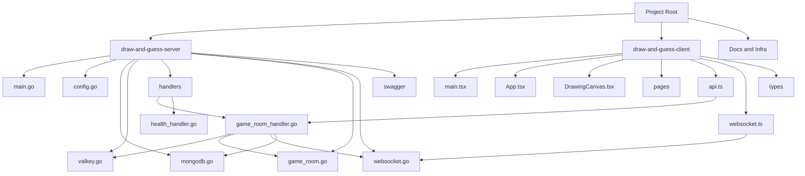

# Architecture Overview

프로젝트 구조를 한눈에 파악할 수 있도록 Mermaid 다이어그램과 텍스트 요약을 제공합니다. 미리보기가 비어 보인다면 아래 방법으로 확인해 주세요.

## Mermaid 미리보기 빠르게 켜기
1. VS Code 명령팔레트에서 `>Extensions: Show Installed Extensions`를 열고 `Markdown Preview Mermaid Support (bierner.markdown-mermaid)`가 `Enabled` 인지 확인합니다.
2. `>Markdown: Open Preview to the Side`를 실행하거나 `Ctrl+K V` 단축키로 옆 창을 띄웁니다.
3. 여전히 비어 있다면 `settings.json`에 아래 항목을 추가하고 VS Code를 재시작합니다.
   ```json
   "markdown.mermaid.enabled": true
   ```
4. 대안으로는 GitHub에서 이 파일을 열거나 https://mermaid.live 에 코드 블록을 붙여넣으면 바로 렌더링됩니다.

---

## System Topology (Mermaid)


---

## 영역별 요약
| 영역 | 주요 파일/폴더 | 핵심 역할 |
| --- | --- | --- |
| Server (`draw-and-guess-server`) | `main.go`, `handlers/`, `models/`, `valkey/`, `websocket/`, `database/` | Gin 기반 API, 게임 로직, Valkey Pub/Sub, Mongo 보조 저장소 |
| Client (`draw-and-guess-client`) | `src/App.tsx`, `pages/`, `components/`, `services/api.ts`, `services/websocket.ts` | Vite + React UI, REST/WS 클라이언트, 드로잉 캔버스 |
| Docs & Infra | `README.md`, `PRD.md`, `NGROK_SETUP.md`, `docker-compose.yml` | 환경 구성, 운영 문서, 로컬 인프라 제어 |

> 다이어그램을 미리 보기가능한 환경에서 열면 위 표와 함께 프로젝트 구조를 훨씬 직관적으로 파악할 수 있습니다.
